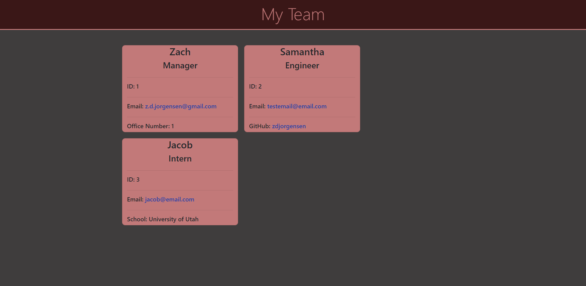

# Team-Profile-Generator

<!-- ABOUT THE PROJECT -->
## About the Project

Application Video : https://drive.google.com/file/d/1QEVBAihm1Cs3AdGLHWjCQczu6u65D7Y4/view

For the tenth challenge `Team Profile Generator`, I created a blank HTML page that is generated from answers given in terminal prompts. The answers from the prompts are used to create objects which are then placed into the HTML page. To start the application use the `node index.js` command and answer the prompts in the terminal. After all prompts have been answered and the choice `Finish Team` is chosen, the HTML page is genereated displaying the manager and any engineers or interns the user input through the prompts. The link to the email opens the user's default email program and populates the TO field and the link to the engineer's gitHub page opens the profile in a new tab and all tests using jest for the program pass.

The hardest part of this challenge for me was trying to figure out why my `Jquery` was not working properly. I never did figure it out but I moved passed it and was able to make the application work in a different way than I was originally planning. To understand how to complete the challenge I used previous Zoom recordings, previous challenges and previous activities. 

<!-- BUILT WITH -->
## Built With
<ul>
    <li> HTML
    <li> CSS
    <li> JavaScript
    <li> Node.js
    <li> Bootstrap
</ul>

<!-- CONTACT ME -->
## Contact

Zachry Jorgensen - z.d.jorgensen@gmail.com

Project Link: https://github.com/zdjorgensen/Team-Profile-Generator

GitHub: https://github.com/zdjorgensen

(<a href="#top">Back to Top</a>)
